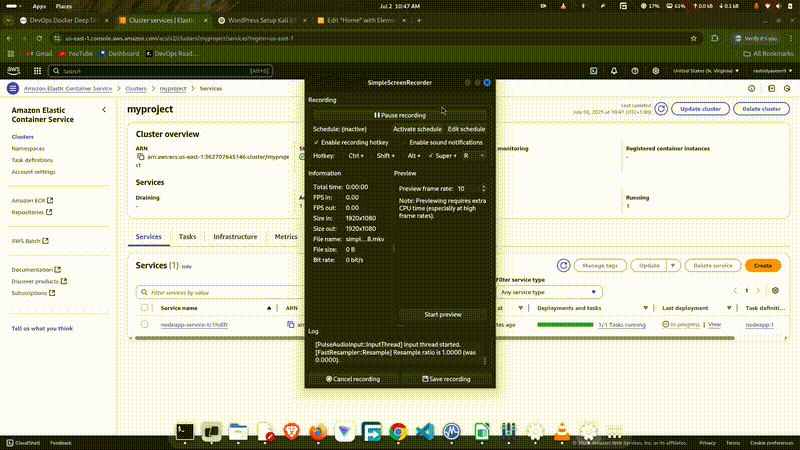

# 🚀 AWS Containerized Node.js App Deployment

This project showcases how I containerized a simple Express.js application using Docker and deployed it on AWS using **ECS (Elastic Container Service)** and **ECR (Elastic Container Registry)**.

I also configured **AWS Security Groups** to expose port `8000` and allow public access to the running containerized app.

---

## 📽️ Demo




> ▶️ Watch the video below to see the complete deployment in action:

**[Aws_Node_app_deployment.mkv](Aws_Node_app_deployment.mkv)**

> If you're viewing this on GitHub, download the `.mkv` file to watch it locally.

---

## 🌐 Project Overview

- ✅ Node.js + Express app
- ✅ Dockerized the application
- ✅ Pushed image to AWS **ECR**
- ✅ Created an ECS **Fargate Task Definition**
- ✅ Launched ECS **Service and Cluster**
- ✅ Opened **port 8000** using Security Group rules
- ✅ Accessed app via public IP

---

## 🛠️ Tech Stack

| Tool           | Purpose                            |
|----------------|-------------------------------------|
| **Node.js**    | Backend runtime                     |
| **Express.js** | Web framework                       |
| **Docker**     | Containerization                    |
| **AWS ECR**    | Image registry                      |
| **AWS ECS**    | Container orchestration (Fargate)   |
| **Security Groups** | Firewall for port 8000        |

---

## 🐳 Dockerfile

```Dockerfile
FROM node:18-alpine

WORKDIR /app

COPY package*.json ./
RUN npm install

COPY src ./src

ARG PORT=8000
ENV PORT=$PORT

EXPOSE $PORT

CMD ["npm", "start"]
